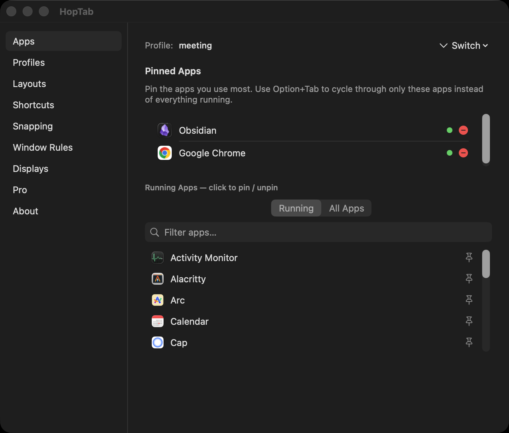
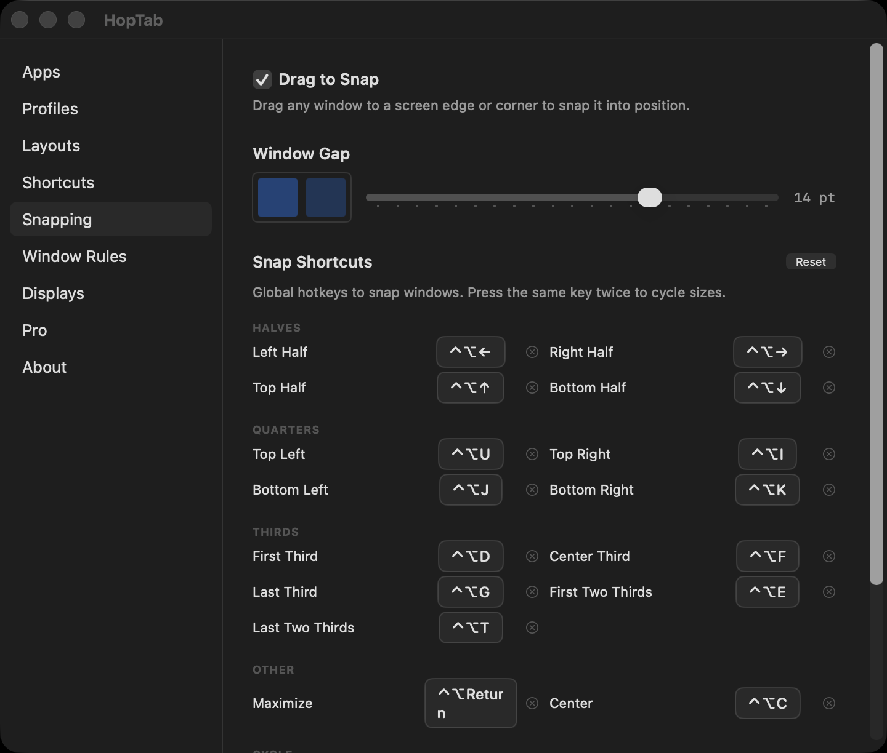
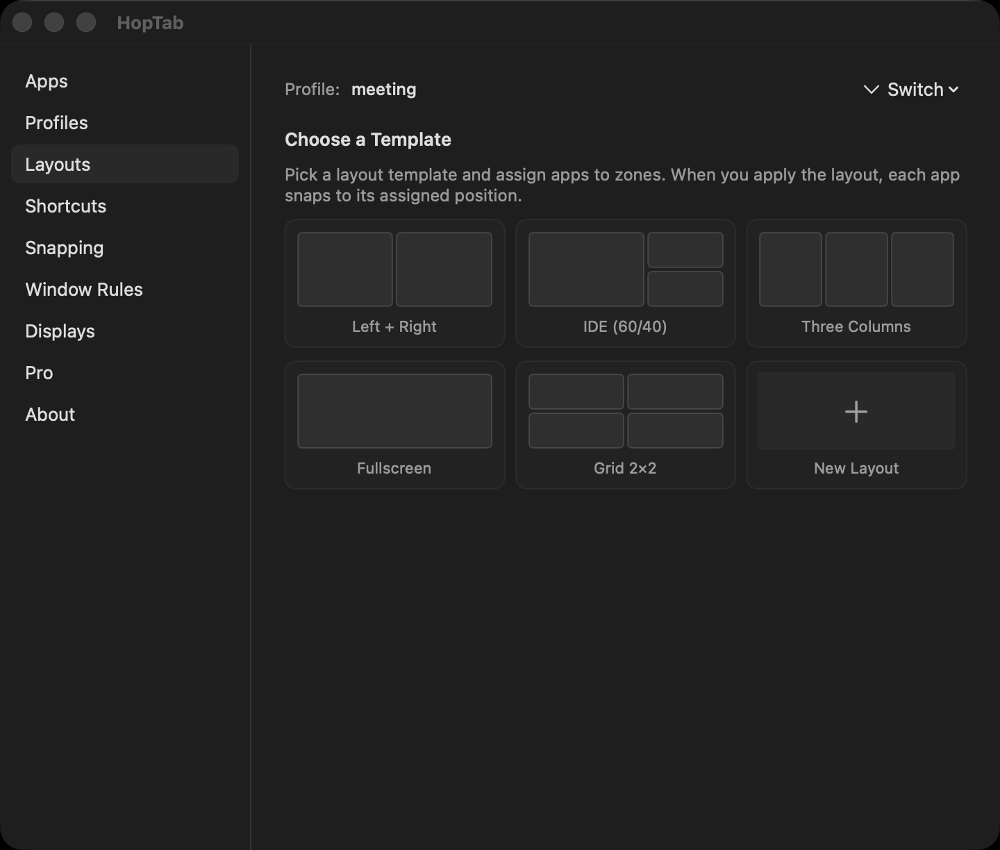
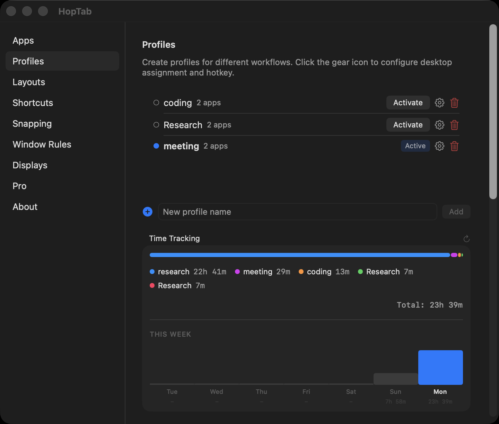
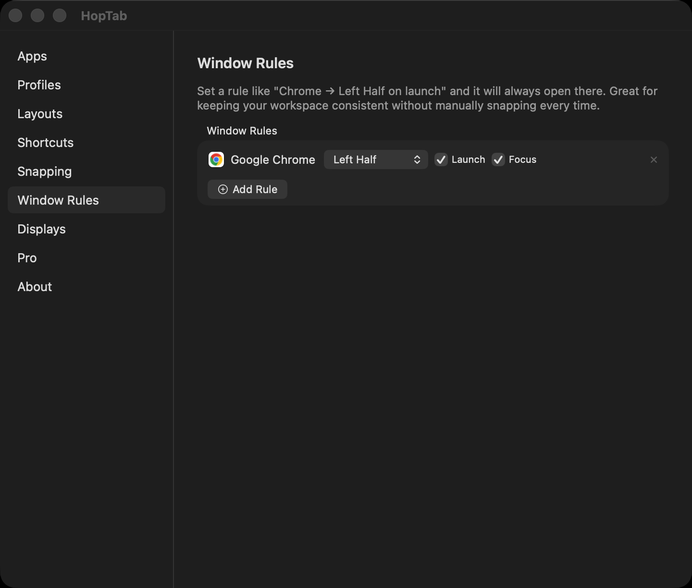
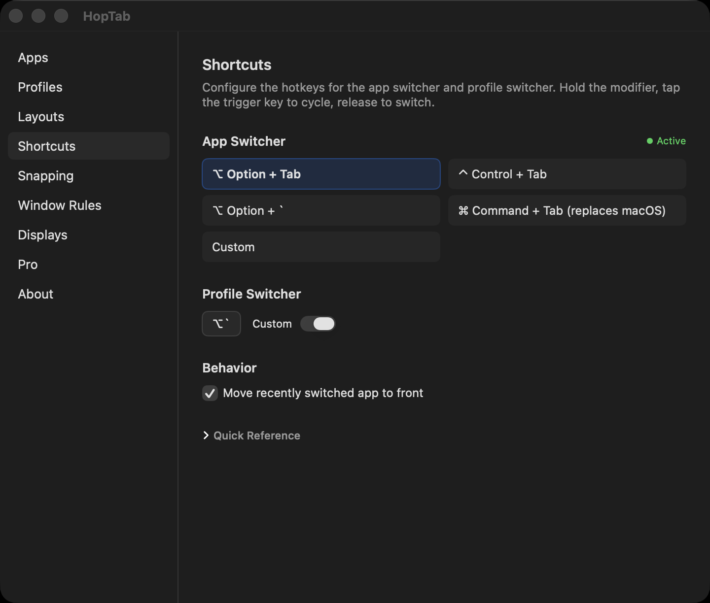
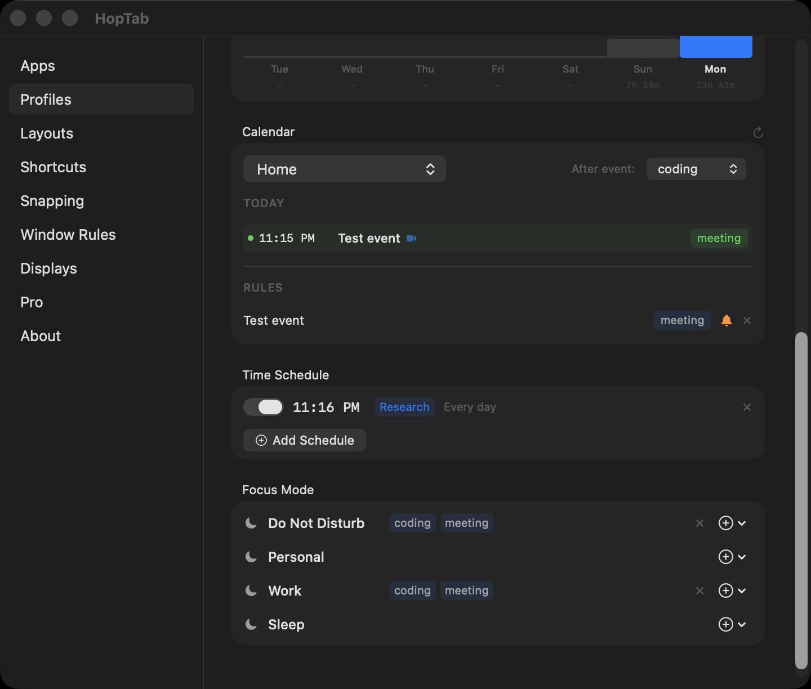

# HopTab

**The workspace manager macOS should've shipped with.**

Pin apps. Tile windows to halves, thirds, quarters. Switch profiles per desktop. Save and restore sessions. All from keyboard shortcuts. Free tier covers everything you need — [HopTab Pro](#hoptab-pro) adds automation for [$5 one-time](https://buy.polar.sh/polar_cl_iKgZQ7w4AWRhnNzsnQBl80syKnFJGHJj1Pv6d2a9tD7).


[](https://discord.gg/6pSMtzBGUr)


[](https://www.youtube.com/watch?v=m5ZpmPWk_kM)

> Click the image to watch the full demo on YouTube

## Install

### Homebrew (recommended)

```bash
brew tap royalbhati/tap
brew install --cask hoptab
```

### Manual

```bash
curl -sL "$(curl -s https://api.github.com/repos/royalbhati/HopTab/releases/latest \
  | grep -o '"browser_download_url": *"[^"]*"' \
  | head -1 | cut -d '"' -f 4)" -o /tmp/HopTab.zip \
  && unzip -o /tmp/HopTab.zip -d /Applications \
  && xattr -c /Applications/HopTab.app
```

Or download from [Releases](../../releases/latest), unzip, drag to `/Applications`, and run:
```bash
xattr -c /Applications/HopTab.app
```

> **Why xattr?** HopTab is ad-hoc signed (not notarized). The command clears macOS's quarantine flag so it opens normally. Homebrew's `--no-quarantine` flag handles this automatically.

### First Launch

1. Grant **Accessibility** permission when prompted
2. Pin your apps in **Settings**
3. Press **Option+Tab** to start hopping

## Features

### Focused App Switching

Pin 2-5 apps per workflow (up to 3 profiles free, unlimited with Pro). `Option+Tab` cycles through only your pinned apps — not the 20 random apps macOS shows. Release to switch. Click to switch works too.

`Cmd+Q` / `Cmd+H` / `Cmd+M` while the switcher is open to quit, hide, or minimize the highlighted app.



### Window Tiling

Global keyboard shortcuts snap any window to halves, thirds, quarters, or fullscreen. Works anytime — no switcher needed.

Press the same direction again to cycle sizes: **1/2 → 1/3 → 2/3**. Undo any snap with one shortcut.



### Drag-to-Snap

Drag any window to a screen edge or corner and a translucent preview overlay shows where it will land. Release to snap.

- **Edges:** left/right half, top to maximize, bottom for bottom half
- **Corners:** quarter snap (top-left, top-right, bottom-left, bottom-right)
- Works with all apps. Toggle on/off in Settings → Snapping. Enabled by default.

### Layout Templates

Five built-in layouts: 50/50 split, IDE 60/40, three columns, 2×2 grid, and fullscreen. Assign apps to zones and apply with one click.

Works with stubborn apps — Chrome, Zed, Wezterm, Electron. Multi-retry positioning with dual strategies for GPU-rendered windows.



### Profiles

Create profiles for different workflows — Coding, Design, Research. Each has its own pinned apps, layout, hotkey, and sticky note.

Assign profiles to macOS Spaces. Swipe between desktops and HopTab auto-switches the active profile. Profile switcher shows each profile's actual app icons.



### Session Management

Save every window's position, size, and z-order per profile. Restore it instantly. Close everything, come back tomorrow, pick up exactly where you left off.

### Window Rules

Define rules like "Chrome always snaps to left half on launch." Free tier includes 2 window rules; Pro unlocks unlimited.



### Fully Customizable

Every shortcut is configurable. The app switcher hotkey, profile switcher, all 17 snap directions, per-profile hotkeys — record whatever combo you want.



## HopTab Pro

Everything above is free. **HopTab Pro** ($5 one-time via [Polar](https://buy.polar.sh/polar_cl_iKgZQ7w4AWRhnNzsnQBl80syKnFJGHJj1Pv6d2a9tD7)) adds automation features that let HopTab manage your workspace without you thinking about it. You can also purchase via [GitHub Sponsors](https://github.com/sponsors/royalbhati).



### Time Tracking

Zero-effort time tracking — HopTab tracks time spent in each profile automatically. See exactly how long you spend coding, designing, or researching each day.

### Calendar Auto-Switch

Maps calendar events to profiles. HopTab reads your calendar, detects Zoom/Teams/Meet links, and switches to the right profile when a meeting starts. Fullscreen meeting reminder with a one-click Join button.

### Time-Based Scheduling

Schedule profile switches: "At 7 PM switch to Entertainment." Supports day-of-week filters so your weekday and weekend routines can differ.

### Focus Mode Integration

Maps macOS Focus modes to profiles. Turn on "Do Not Disturb" and HopTab switches to your deep work profile. Supports multiple profiles per Focus mode.

### Display Auto-Profiles

Automatically switch profiles when monitors connect or disconnect. Dock your laptop at work and your work profile activates; undock and your laptop profile takes over.

### Unlimited Window Rules

Free tier includes 2 window rules. Pro removes the limit — define as many as you need.

### Custom Layouts with Exact Percentages

Build layouts with precise zone percentages. Perfect for ultrawide monitors, rotated displays, and non-standard setups.

### Unlimited Profiles

Free tier includes 3 profiles. Pro removes the limit.

> **Student or can't afford it?** Email rawyelll@gmail.com for a free Pro key. No questions asked.

## Pricing

| | Free | Pro |
|--|------|-----|
| **Price** | Free & open source | $5 one-time via [Polar](https://buy.polar.sh/polar_cl_iKgZQ7w4AWRhnNzsnQBl80syKnFJGHJj1Pv6d2a9tD7) or [GitHub Sponsors](https://github.com/sponsors/royalbhati) |
| App switching (Option+Tab) | Yes | Yes |
| Window tiling (17 snap directions) | Yes | Yes |
| Drag-to-snap (edges & corners) | Yes | Yes |
| Snap size cycling | Yes | Yes |
| Undo snap | Yes | Yes |
| Move between monitors | Yes | Yes |
| Layout templates (5 built-in) | Yes | Yes |
| Session save/restore | Yes | Yes |
| Configurable gaps | Yes | Yes |
| Profiles | 3 | Unlimited |
| Window rules | 2 | Unlimited |
| Custom layouts (exact %) | — | Yes |
| Time tracking | — | Yes |
| Calendar auto-switch | — | Yes |
| Time-based scheduling | — | Yes |
| Focus mode integration | — | Yes |
| Display auto-profiles | — | Yes |

## Keyboard Shortcuts

### App Switcher

| Action | Shortcut |
|--------|----------|
| Cycle forward | `Option` + `Tab` |
| Cycle backward | `Shift` + `Option` + `Tab` |
| Switch to selected | Release `Option` |
| Quit / Hide / Minimize | `Cmd+Q` / `Cmd+H` / `Cmd+M` |
| Cancel | `Escape` |

### While Switcher Open

| Action | Shortcut |
|--------|----------|
| Snap left / right / top / bottom | `←` `→` `↑` `↓` |

### Global Window Tiling

| Action | Shortcut |
|--------|----------|
| Left / Right / Top / Bottom half | `Ctrl+Opt` + `←` `→` `↑` `↓` |
| Quarters (TL / TR / BL / BR) | `Ctrl+Opt` + `U` `I` `J` `K` |
| First / Center / Last third | `Ctrl+Opt` + `D` `F` `G` |
| First / Last two-thirds | `Ctrl+Opt` + `E` `T` |
| Maximize | `Ctrl+Opt` + `Return` |
| Center | `Ctrl+Opt` + `C` |
| Undo snap | `Ctrl+Opt` + `Z` |

### Drag-to-Snap (Mouse)

| Action | Gesture |
|--------|---------|
| Left / Right half | Drag to left / right edge |
| Maximize | Drag to top edge |
| Bottom half | Drag to bottom edge |
| Quarter snap | Drag to any corner |

A translucent preview overlay appears at the target zone. Toggle in Settings → Snapping.

### Monitors

| Action | Shortcut |
|--------|----------|
| Next monitor | `Ctrl+Opt+Cmd` + `→` |
| Previous monitor | `Ctrl+Opt+Cmd` + `←` |

### Profiles

| Action | Shortcut |
|--------|----------|
| Switch profile | `Option` + `` ` `` |
| Cycle backward | `Shift` + `Option` + `` ` `` |

All shortcuts are fully configurable in Settings → Windows tab.

## Example Workflow

| Profile | Pinned Apps | Desktop | Hotkey |
|---------|------------|---------|--------|
| Coding | Zed, Wezterm, Chrome, TablePlus | Desktop 1 | `Ctrl+1` |
| Design | Figma, Safari, Preview | Desktop 2 | `Ctrl+2` |
| Research | Chrome, Notion, Obsidian | Desktop 3 | `Ctrl+3` |

Swipe to Desktop 1 → profile auto-switches → `Option+Tab` hops between Zed, Wezterm, Chrome, TablePlus.

Press `Ctrl+3` → session saved, Research profile restored with all windows back in position.

## Build from Source

Requires **Xcode 15+** and **macOS 14+**.

```bash
git clone https://github.com/royalbhati/HopTab.git
cd HopTab
open HopTab.xcodeproj
# Cmd+R to build and run
```

## Technical Notes

- **CGEvent tap** to intercept global shortcuts (session-level, head-insert)
- **AXUIElement API** for window positioning with multi-retry and dual strategies
- **AXEnhancedUserInterface** enabled before window queries (fixes Chrome, Electron, Zed)
- **NSPanel** non-activating overlay at `.screenSaver` level
- **Sidebar settings** with NavigationSplitView for preferences
- **No App Sandbox** — required for `CGEvent.tapCreate`
- **CGSGetActiveSpace** private API for desktop-to-profile mapping
- **Cycle tracker** — same-direction snaps within 1.5s cycle through sizes
- **Undo stack** — per-window frame saved before each snap

## Community

- [Discord](https://discord.gg/6pSMtzBGUr) — feature requests, support, feedback
- [GitHub Issues](https://github.com/royalbhati/HopTab/issues) — bug reports
- [Website](https://www.royalbhati.com/hoptab) — docs and download

## License

MIT. See [LICENSE](LICENSE).
