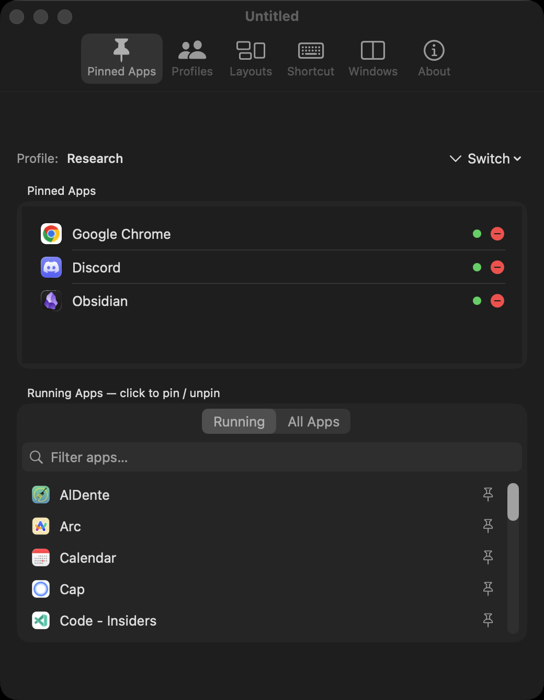
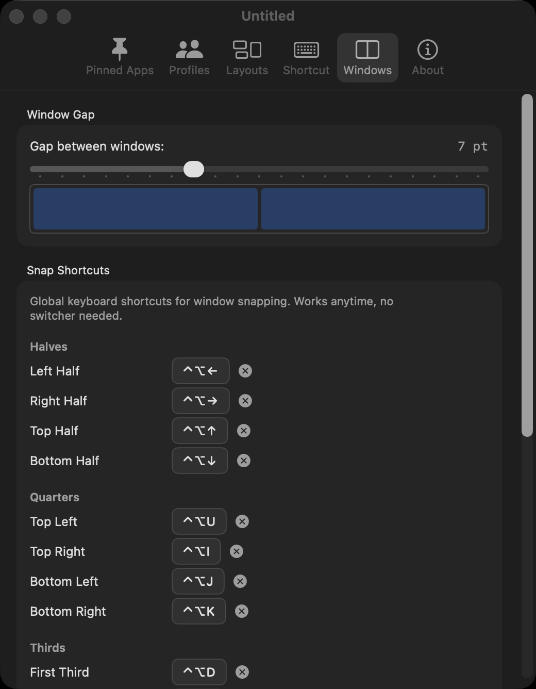
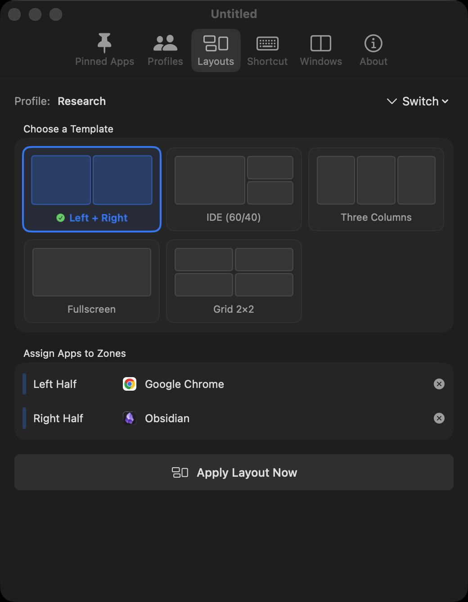
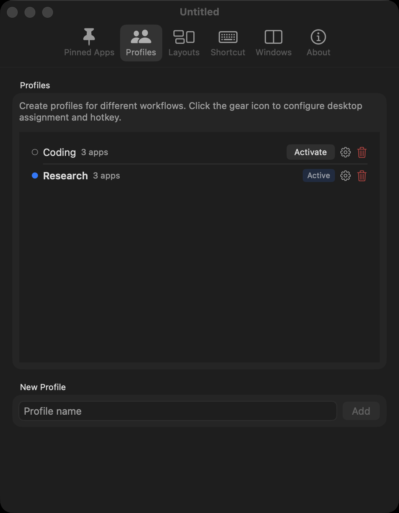
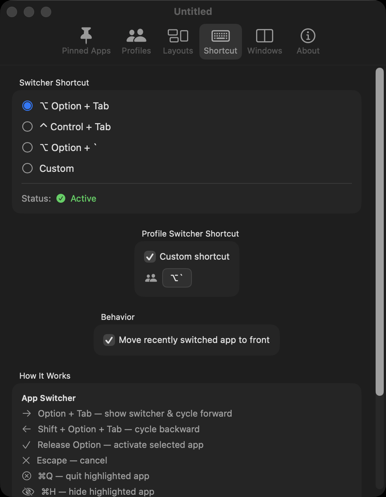

# HopTab

**The workspace manager macOS should've shipped with.**

Pin apps. Tile windows to halves, thirds, quarters. Switch profiles per desktop. Save and restore sessions. All from keyboard shortcuts.


<video src="https://github.com/user-attachments/assets/hoptab-working.mp4" autoplay loop muted playsinline width="100%"></video>

https://github.com/royalbhati/HopTab/assets/demo/hoptab_working.mp4


## Quick Start

```bash
curl -sL "$(curl -s https://api.github.com/repos/royalbhati/HopTab/releases/latest \
  | grep -o '"browser_download_url": *"[^"]*"' \
  | head -1 | cut -d '"' -f 4)" -o /tmp/HopTab.zip \
  && unzip -o /tmp/HopTab.zip -d /Applications \
  && xattr -c /Applications/HopTab.app
```

Or download from [Releases](../../releases/latest), unzip, drag to `/Applications`, and run:
```bash
xattr -c /Applications/HopTab.app
```

> **Why xattr?** HopTab is ad-hoc signed (not notarized). The command clears macOS's quarantine flag so it opens normally.

### First Launch

1. Grant **Accessibility** permission when prompted
2. Pin your apps in **Settings**
3. Press **Option+Tab** to start hopping

## Features

### Focused App Switching

Pin 2-5 apps per workflow. `Option+Tab` cycles through only your pinned apps — not the 20 random apps macOS shows. Release to switch. Click to switch works too.

`Cmd+Q` / `Cmd+H` / `Cmd+M` while the switcher is open to quit, hide, or minimize the highlighted app.



### Window Tiling

Global keyboard shortcuts snap any window to halves, thirds, quarters, or fullscreen. Works anytime — no switcher needed.

Press the same direction again to cycle sizes: **1/2 → 1/3 → 2/3**. Undo any snap with one shortcut.



### Layout Templates

Five built-in layouts: 50/50 split, IDE 60/40, three columns, 2×2 grid, and fullscreen. Assign apps to zones and apply with one click.

Works with stubborn apps — Chrome, Zed, Wezterm, Electron. Multi-retry positioning with dual strategies for GPU-rendered windows.



### Profiles

Create profiles for different workflows — Coding, Design, Research. Each has its own pinned apps, layout, hotkey, and sticky note.

Assign profiles to macOS Spaces. Swipe between desktops and HopTab auto-switches the active profile. Profile switcher shows each profile's actual app icons.



### Session Management

Save every window's position, size, and z-order per profile. Restore it instantly. Close everything, come back tomorrow, pick up exactly where you left off.

### Fully Customizable

Every shortcut is configurable. The app switcher hotkey, profile switcher, all 17 snap directions, per-profile hotkeys — record whatever combo you want.



## Keyboard Shortcuts

### App Switcher

| Action | Shortcut |
|--------|----------|
| Cycle forward | `Option` + `Tab` |
| Cycle backward | `Shift` + `Option` + `Tab` |
| Switch to selected | Release `Option` |
| Quit / Hide / Minimize | `Cmd+Q` / `Cmd+H` / `Cmd+M` |
| Cancel | `Escape` |

### While Switcher Open

| Action | Shortcut |
|--------|----------|
| Snap left / right / top / bottom | `←` `→` `↑` `↓` |

### Global Window Tiling

| Action | Shortcut |
|--------|----------|
| Left / Right / Top / Bottom half | `Ctrl+Opt` + `←` `→` `↑` `↓` |
| Quarters (TL / TR / BL / BR) | `Ctrl+Opt` + `U` `I` `J` `K` |
| First / Center / Last third | `Ctrl+Opt` + `D` `F` `G` |
| First / Last two-thirds | `Ctrl+Opt` + `E` `T` |
| Maximize | `Ctrl+Opt` + `Return` |
| Center | `Ctrl+Opt` + `C` |
| Undo snap | `Ctrl+Opt` + `Z` |

### Monitors

| Action | Shortcut |
|--------|----------|
| Next monitor | `Ctrl+Opt+Cmd` + `→` |
| Previous monitor | `Ctrl+Opt+Cmd` + `←` |

### Profiles

| Action | Shortcut |
|--------|----------|
| Switch profile | `Option` + `` ` `` |
| Cycle backward | `Shift` + `Option` + `` ` `` |

All shortcuts are fully configurable in Settings → Windows tab.

## Example Workflow

| Profile | Pinned Apps | Desktop | Hotkey |
|---------|------------|---------|--------|
| Coding | Zed, Wezterm, Chrome, TablePlus | Desktop 1 | `Ctrl+1` |
| Design | Figma, Safari, Preview | Desktop 2 | `Ctrl+2` |
| Research | Chrome, Notion, Obsidian | Desktop 3 | `Ctrl+3` |

Swipe to Desktop 1 → profile auto-switches → `Option+Tab` hops between Zed, Wezterm, Chrome, TablePlus.

Press `Ctrl+3` → session saved, Research profile restored with all windows back in position.

## Build from Source

Requires **Xcode 15+** and **macOS 14+**.

```bash
git clone https://github.com/royalbhati/HopTab.git
cd HopTab
open HopTab.xcodeproj
# Cmd+R to build and run
```

## Technical Notes

- **CGEvent tap** to intercept global shortcuts (session-level, head-insert)
- **AXUIElement API** for window positioning with multi-retry and dual strategies
- **AXEnhancedUserInterface** enabled before window queries (fixes Chrome, Electron, Zed)
- **NSPanel** non-activating overlay at `.screenSaver` level
- **NSTabViewController** with toolbar tab style for preferences
- **No App Sandbox** — required for `CGEvent.tapCreate`
- **CGSGetActiveSpace** private API for desktop-to-profile mapping
- **Cycle tracker** — same-direction snaps within 1.5s cycle through sizes
- **Undo stack** — per-window frame saved before each snap

## License

MIT. See [LICENSE](LICENSE).
